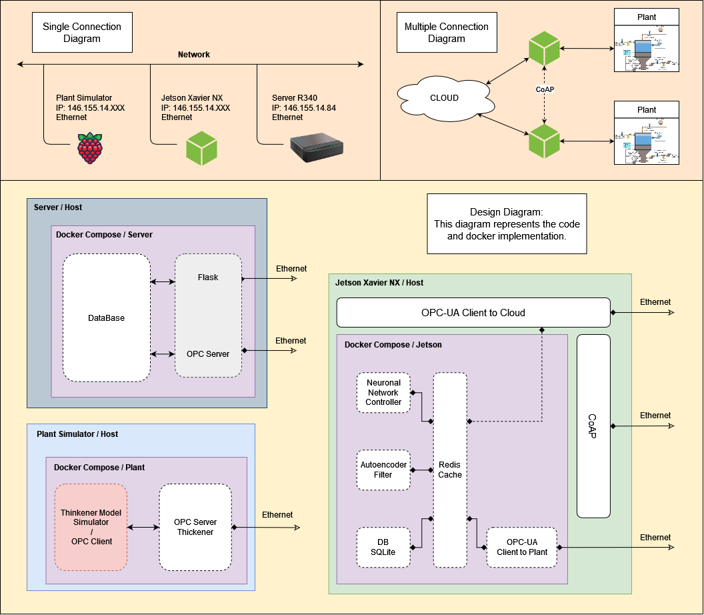

# iot-dev-4tanks
An Internet of Things (IoT) implementation of a neural-based filter (AutoEncoder) for a 4-tank plant control loop.

A first approach implementation can be seen in the following diagram. The design contains 3 main archiquectures (Jetson/Controller, Server and Plant) with their respective containers inside.

